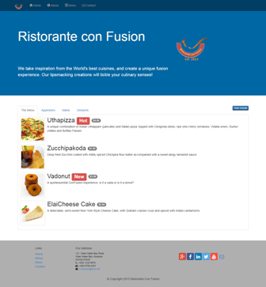

# conFusion Restaurant ( BootStrap­ - AngularJS­ ) 

AngularJS Web Application

## Demo

## technologies
* HTML5, CSS, JS, [Bootstrap](http://getbootstrap.com/): frone-end
* [AngularJs framework](https://angular.io/)
* [Gulpjs](https://gulpjs.com/): automation

## How to run application on the local computer :

Open bash or cmd and direct to conFusion folder then

1)  install dependencies
> npm  install

2)  run json server
> json-server .\json-server\db.json

3)  serve with hot reload at localhost:3001
> gulp watch
  
  
## License

[MIT License].
